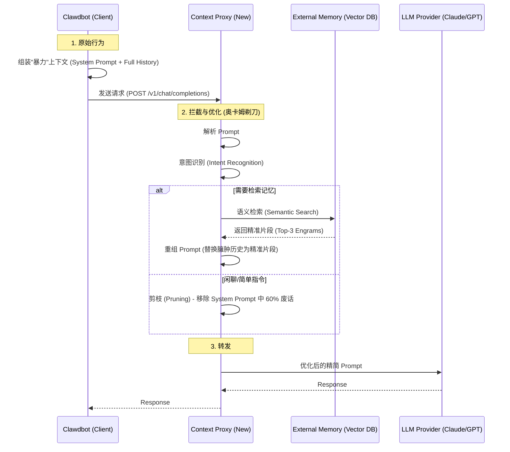

# Clawdbot (Moltbot) 轻量化上下文优化实施方案

## 1. 核心策略选择：为何选择"反向代理模式"？

针对您"**外挂式记忆系统**"、"**最轻量化**"、"**不改动源码**"的需求，最佳的技术路径是构建一个 **AI Context Firewall (上下文防火墙)**，即一个**反向代理 (Reverse Proxy)**。

### 1.1 架构对比

| 方案 | 修改源码? | 侵入性 | 实现难度 | 维护成本 | 结论 |
| :--- | :--- | :--- | :--- | :--- | :--- |
| **方案 A: 源码修改** | 是 (深入 Core) | 高 | 高 (需读懂整个 Memory 逻辑) | 高 (无法随官方升级) | ❌ 抛弃 |
| **方案 B: 插件 (Skill)** | 否 | 低 | 中 (受限于插件 API 权限) | 低 | ❌ 无法干预全局 Context |
| **方案 C: API 代理** | **否 (仅改 Config)** | **零** | **中 (独立项目)** | **低 (完全解耦)** | **✅ 推荐** |

### 1.2 方案原理
Clawdbot 本质上是一个 HTTP Client，它向 LLM 提供商（如 Anthropic/OpenAI）发送请求。
我们只需将 Clawdbot 的 `base_url` 指向我们开发的 **Proxy Server**，而非官方 API。



---

## 2. 具体实现逻辑

### 2.1 组件设计
我们需要开发一个轻量级的 Python 服务（建议使用 `FastAPI` 或 `LiteLLM`），作为"外挂大脑"。

**组件清单**:
1.  **Proxy Server**: 模拟 OpenAI/Anthropic API 格式的 Web 服务。
2.  **Context Surgeon (手术刀)**: 负责解剖传入的 JSON Body，提取 `messages` 列表。
3.  **Memory Store**: 一个独立的向量数据库（如 `ChromaDB` 或 `Qdrant`），用于存储长期记忆，替代 Clawdbot 的文件系统。

### 2.2 数据流处理 (The Pipeline)

当 Proxy 收到请求时，按以下步骤处理：

1.  **快照 (Snapshot)**: 
    *   Clawdbot 发来的请求通常包含巨大的 `messages` 数组。
    *   Proxy 首先计算当前 User Message 的 Embedding。

2.  **过滤 (Filtering - 奥卡姆剃刀应用)**:
    *   **System Prompt 清洗**: 识别并剔除 `SOUL.md` 中被标记为"冗余"的段落（可维护一个 `ignore_patterns` 列表）。
    *   **历史记录压缩**: 即使 Clawdbot 发来了 50 条历史记录，Proxy 也可以强制只保留最近 5 条（Short-term Memory），并从 Vector DB 中拉取与当前问题最相关的 3 条旧记录（Long-term Memory）插入到 System Prompt 中。

3.  **注入 (Injection)**:
    *   将检索到的精准信息作为 `System Message` 的一部分注入："*Relevant Context from Memory: ...*"。

4.  **转发 (Forwarding)**:
    *   将修改后的 Payload 发送给真实的 LLM API。

### 2.3 这一方案的优势
1.  **零源码修改**: 你只需要修改 Clawdbot 的配置文件：
    ```json
    // clawdbot config
    {
      "llm_provider": "openai",
      "base_url": "http://localhost:8080/v1",  // 指向我们的 Proxy
      "api_key": "sk-dummy"
    }
    ```
2.  **独立进化**: 你的上下文优化逻辑（PromptX 风格的认知引擎）可以在 Proxy 中无限迭代，完全不受 Clawdbot 及其更新的影响。
3.  **可观测性**: 你可以在 Proxy 中打印日志，精确看到 Clawdbot 到底浪费了多少 Token，以及你的优化节省了多少。

---

## 3. 实施路线图 (Roadmap)

1.  **Phase 1: 透明代理 (Pass-through Proxy)**
    *   搭建一个 FastAPI 服务，接收请求并原样转发给 Anthropic。
    *   **目的**: 验证 Clawdbot 能通过代理正常工作，打通链路。

2.  **Phase 2: 流量分析与剪枝 (Analysis & Pruning)**
    *   记录 Clawdbot 发出的 Prompt 结构。
    *   实现简单的正则规则，去除 Prompt 中的无效样板文字。

3.  **Phase 3: 外挂记忆挂载 (External Memory Mounting)**
    *   引入向量数据库。
    *   在 Proxy 层实现"查询-检索-替换"的 RAG 逻辑，正式接管记忆功能。

## 4. 总结
**不需要修改 Clawdbot 源码。**
**不仅是"可以"外挂，而且"必须"外挂。**
通过构建一个 **API Proxy**，你实际上是在网络层实施了"中间人攻击 (Man-in-the-Middle)"，从而获得对上下文的绝对控制权。这是最优雅、最符合系统解耦原则的实现方式。
